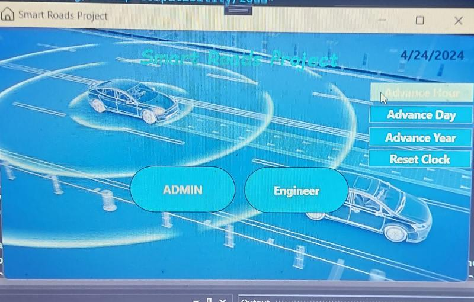
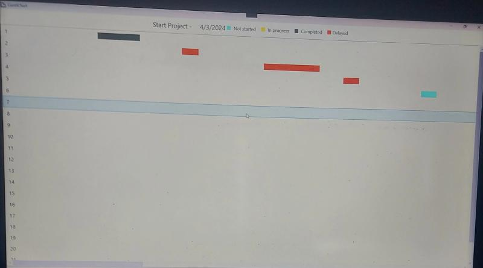
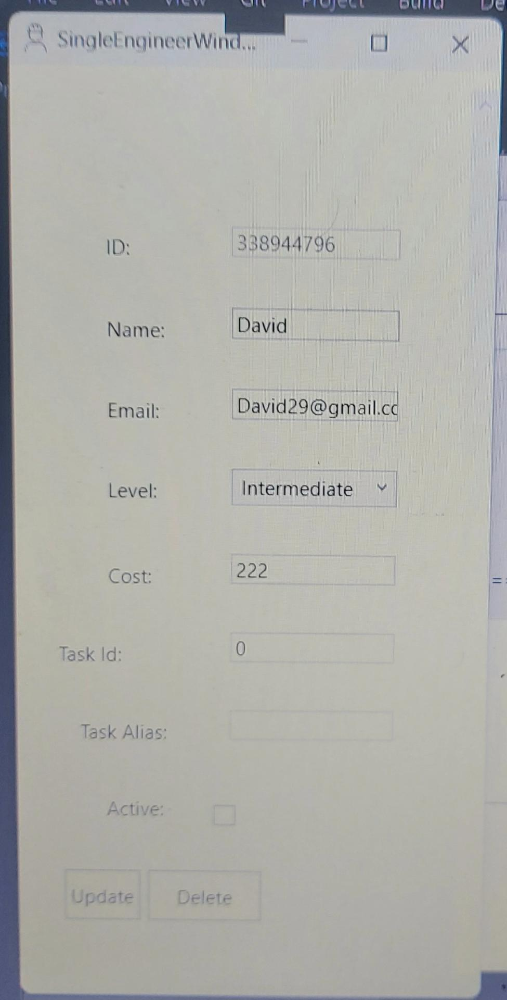
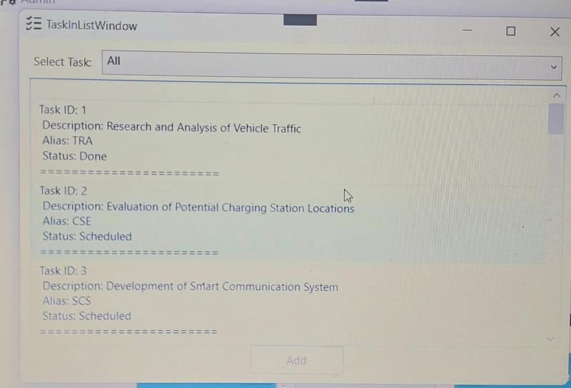
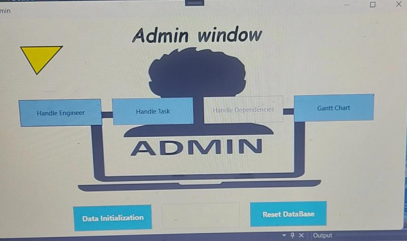

# Project Management System for Windows


---
<br>

A comprehensive **Project Management System** built with **.NET 7.0** and **WPF** for Windows environments. This application provides robust tools for managing engineering projects, tasks, dependencies, and team members with an intuitive graphical interface.

## 📋 Table of Contents

- [Overview](#overview)
- [Features](#features)
- [Technology Stack](#technology-stack)
- [Architecture](#architecture)
- [Prerequisites](#prerequisites)
- [Installation](#installation)
- [Usage](#usage)
- [Project Structure](#project-structure)
- [Bonus Features](#bonus-features)

## 🌟 Overview

This project is a **C# .NET-based system** that simulates the **charging of electric vehicles (EVs)** while driving on **smart roads** equipped with **embedded charging technology**.

In addition, it features a **comprehensive project management environment** tailored for **Windows systems**, designed to support efficient engineering workflow management.  
The system enables:

- **Task tracking** and progress monitoring  
- **Engineer allocation** and workload management  
- **Dependency tracking** between tasks  
- **Visualization of project timelines** using interactive **Gantt charts**

Together, these components provide a **complete and intuitive solution** for managing complex engineering projects in a simulated smart transportation ecosystem.


---
<br>


The system follows a **three-tier architecture** pattern:
- **Presentation Layer (PL)** - WPF-based user interface
- **Business Logic Layer (BL)** - Core business rules and logic
- **Data Access Layer (DAL)** - Multiple data storage implementations (XML, In-Memory List)

## ✨ Features

### Core Functionality

- **Task Management**
  - Create, read, update, and delete tasks
  - Track task status (Unscheduled, Scheduled, OnTrack, InJeopardy, Done)
  - Set task complexity levels and required effort time
  - Define task dependencies and milestones
  - Automatic scheduling capabilities

- **Engineer Management**
  - Manage engineer profiles with experience levels
  - Track engineer costs and availability
  - Assign engineers to tasks
  - Monitor engineer workload

- **Project Planning**
  - Visual Gantt chart for project timeline
  - Dependency management between tasks
  - Milestone tracking
  - Automatic schedule generation
  - Deadline and forecast date tracking

- **Administrative Tools**
  - Admin panel for system-wide operations
  - Project initialization and configuration
  - Data persistence with XML storage
  - Virtual time functionality for testing and simulation

### User Interface Features


<br>



<br>



---
<br>


- **Modern WPF Interface**
  - Responsive design with custom window styles
  - Intuitive navigation between different modules
  - Rich visual feedback with icons and images
  - Color-coded status indicators

- **Interactive Components**
  - Dynamic form validation
  - Real-time data updates
  - Custom triggers for enhanced UX
  - Cost visualization graphics

## 🛠 Technology Stack

- **Framework:** .NET 7.0
- **UI Framework:** Windows Presentation Foundation (WPF)
- **Language:** C#
- **Data Storage:** 
  - XML-based persistence
  - In-memory list implementation
- **Architecture Pattern:** Three-tier architecture
- **Development Tools:** Visual Studio 2022

## 🏗 Architecture

The application follows a clean three-tier architecture:

```
┌─────────────────────────────────────┐
│   Presentation Layer (PL)           │
│   - WPF Windows & Controls          │
│   - XAML Views                      │
│   - Converters & Value Converters   │
└─────────────────────────────────────┘
              ↓ ↑
┌─────────────────────────────────────┐
│   Business Logic Layer (BL)         │
│   - Business Objects (BO)           │
│   - Business Logic Implementation   │
│   - Validation & Rules              │
└─────────────────────────────────────┘
              ↓ ↑
┌─────────────────────────────────────┐
│   Data Access Layer (DAL)           │
│   - DalFacade (Interface)           │
│   - DalXml (XML Implementation)     │
│   - DalList (In-Memory)             │
└─────────────────────────────────────┘
```


## 📦 Prerequisites

Before running this project, ensure you have:

- **Windows Operating System** (Windows 10 or later recommended)
- **.NET 7.0 SDK or Runtime** - [Download here](https://dotnet.microsoft.com/download/dotnet/7.0)
- **Visual Studio 2022** (recommended) or any C# IDE with WPF support
- **Git** (for cloning the repository)

## 🚀 Installation

1. **Clone the Repository**
   ```bash
   git clone https://github.com/amitmoradov/Project-management-in-Windows-systems.git
   cd Project-management-in-Windows-systems
   ```

2. **Open the Solution**
   - Navigate to `dotNet5784_7061_3114` directory
   - Open `dotNet5784_7061_3114.sln` in Visual Studio

3. **Restore NuGet Packages**
   ```bash
   dotnet restore
   ```

4. **Build the Solution**
   ```bash
   dotnet build
   ```

5. **Run the Application**
   - Set `PL` as the startup project
   - Press `F5` or click "Start" in Visual Studio

   Or use the command line:
   ```bash
   dotnet run --project dotNet5784_7061_3114/PL/PL.csproj
   ```

## 💡 Usage

### First-Time Setup

1. **Launch the Application** - Run the PL project
2. **Initialize the System** - Use the Admin panel to set up initial project data
3. **Configure Project Settings** - Set project start dates and parameters

### Managing Engineers

1. Navigate to **Engineer Management** from the main menu
2. Add new engineers with their details (ID, name, email, experience level, cost)
3. View and edit existing engineer profiles
4. Assign engineers to tasks

### Managing Tasks

1. Access **Task Management** module
2. Create new tasks with:
   - Task name (alias) and description
   - Required effort time
   - Complexity level
   - Dependencies on other tasks
3. Assign engineers to tasks
4. Track task progress and status

### Viewing Project Timeline

1. Open the **Gantt Chart** view
2. Visualize task timeline and dependencies
3. Identify critical path and potential delays
4. Monitor project progress with color-coded indicators

### Admin Functions

- **Initialize Data** - Reset and populate sample data
- **Set Project Dates** - Configure project timeline
- **Manage Virtual Time** - Simulate time progression for testing
- **View System Status** - Monitor overall project health

## 📁 Project Structure

```
dotNet5784_7061_3114/
├── PL/                          # Presentation Layer (WPF UI)
│   ├── ADMIN/                   # Admin panel windows
│   ├── Engineer/                # Engineer management UI
│   ├── Task/                    # Task management UI
│   ├── Gantt/                   # Gantt chart visualization
│   ├── Dependency/              # Dependency management UI
│   ├── Project/                 # Project settings UI
│   ├── Converters.cs            # WPF value converters
│   ├── MainWindow.xaml          # Main application window
│   └── App.xaml                 # Application resources & styles
│
├── BL/                          # Business Logic Layer
│   ├── BO/                      # Business Objects
│   │   ├── Engineer.cs
│   │   ├── Task.cs
│   │   ├── Dependency.cs
│   │   └── Enums.cs
│   ├── BlApi/                   # Business Logic Interfaces
│   └── BlImplementation/        # BL Implementation
│       ├── EngineerImplementation.cs
│       ├── TaskImplementation.cs
│       └── ProjectImplementation.cs
│
├── DalFacade/                   # Data Access Layer Interface
│   └── DO/                      # Data Objects
│
├── DalXml/                      # XML-based DAL Implementation
│   ├── EngineerImplementation.cs
│   ├── TaskImplementation.cs
│   ├── DependencyImplementation.cs
│   └── XmlTools.cs
│
├── DalList/                     # In-Memory DAL Implementation
│
├── DalTest/                     # DAL Unit Tests
├── BlTest/                      # BL Unit Tests
├── Stege0/                      # Initial/Testing stage
└── xml/                         # XML data storage
```

## 🎁 Bonus Features

The application includes several advanced features:

### Event Trigger
- **Location:** [Admin panel display layer](https://github.com/amitmoradov/dotNet5784_7061_3114/blob/449e20e58018429d1056060494a47e66b112cd5d/dotNet5784_7061_3114/PL/MainWindow.xaml#L21)
- **Functionality:** Activated by the "Manage Engineers List" button

### Data Trigger
- **Location:** [Task window display layer](https://github.com/amitmoradov/dotNet5784_7061_3114/blob/0de0126296490bd5b4106e90d5bca6ff3fe2b036/dotNet5784_7061_3114/PL/Task/SingleTaskWindow.xaml#L121)
- **Functionality:** Activated in the "Engineer Allocation" field

### Property Trigger
- **Location:** [Engineer window display layer](https://github.com/amitmoradov/dotNet5784_7061_3114/blob/361bc5e3af898898dcb07129411c43ee2df54a0e/dotNet5784_7061_3114/PL/ADMIN/Admin.xaml#L23)
- **Functionality:** Concerns the engineer's price field

### Virtual Time Clock
- **Location:** [Project implementation](https://github.com/amitmoradov/dotNet5784_7061_3114/blob/02270b866cab6120596178a5668fa5219aec8ac2/dotNet5784_7061_3114/DalXml/ProjectImplementation.cs#L65)
- **Functionality:** Utilizes "virtual time" functions for simulation, triggering UI updates and persisting data

### Color-Coded Gantt Chart
- **Location:** [PL Converters](https://github.com/amitmoradov/dotNet5784_7061_3114/blob/7eed2777c0706f53d6ab5082d0b1c9974fba3af6/dotNet5784_7061_3114/PL/Converters.cs#L246)
- **Functionality:** Uses a dictionary to apply status-based colors to Gantt chart elements

### Automatic Scheduling
- **Location:** [BL Task Implementation](https://github.com/amitmoradov/dotNet5784_7061_3114/blob/45757d8186d7d3c90f6be8e200d9731299c223be/dotNet5784_7061_3114/BL/BlImplementation/TaskImplementation.cs#L289)
- **Functionality:** Automates task scheduling based on dependencies and constraints

### Custom Window Styling
- **Location:** [App.xaml](https://github.com/amitmoradov/dotNet5784_7061_3114/blob/6e2e11ccc2fae43d49f5cc690c70e04024bf5551/dotNet5784_7061_3114/PL/App.xaml#L17)
- **Functionality:** Applies consistent visual styling across all windows

### Cost Graphics
- **Location:** [Engineer window](https://github.com/amitmoradov/dotNet5784_7061_3114/blob/e3ce614f790435caa0b959db0d3023c11a7a36ce/dotNet5784_7061_3114/PL/Engineer/SingleEngineerWindow.xaml#L75)
- **Functionality:** Displays visual representations of cost data

### Custom Shapes
- **Location:** [Admin window](https://github.com/amitmoradov/dotNet5784_7061_3114/blob/dc3c3e39f6cd858490a54c78e0704836458ba90b/dotNet5784_7061_3114/PL/ADMIN/Admin.xaml#L42)
- **Functionality:** Incorporates custom geometric shapes for enhanced UI design

---
**Developed as part of a software engineering course**

## 📬 Contact
For questions or feedback, please open an issue on GitHub.
